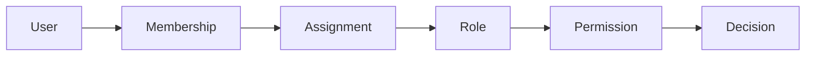
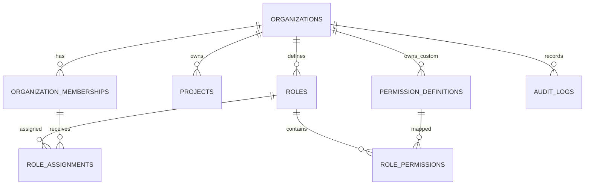

# PermissionGraph


A multi-tenant authorization and access-control platform built with ASP.NET Core, Clean Architecture, PostgreSQL, Redis, and policy-based authorization.

## Overview

PermissionGraph answers one backend security question:

```text
Can user U perform permission P inside organization O,
optionally on resource/project R, at time T?
```

It is a multi-tenant, permission-based authorization system with organization and project/resource scopes, custom roles, custom permissions, temporary role assignments, audit records, versioned authorization invalidation, Redis decision caching, and deny-by-default behavior.
## Demo & Verification

The backend can be inspected locally through the ASP.NET Core Swagger document, exercised through HTTP clients such as Postman, and verified through the automated test suite.

| Asset | Location |
|---|---|
| Local API base URL | `http://localhost:5208` |
| |
| Postman Collection | `docs/postman/PermissionGraph.postman_collection.json` |
| Postman Environment | `docs/postman/PermissionGraph.local.postman_environment.json` |
| Postman Instructions | `docs/postman/README.md` |
| Test command | `dotnet test PermissionGraph.slnx -c Release` |

Swagger UI is configured in the current API project.


## Why This Project Exists

Many real systems outgrow simple `Admin` and `User` roles. They need tenant isolation, custom permissions, project/resource-level access, temporary or scheduled access, auditability, and authorization decisions that remain safe when roles, memberships, or assignments change.

PermissionGraph models those concerns as backend authorization infrastructure rather than UI visibility. The API enforces authorization server-side, protects tenant boundaries, prevents common privilege-escalation paths, and records security-sensitive mutations.

## Core Authorization Model



| Concept | Meaning |
|---|---|
| User | Global ASP.NET Core Identity account. |
| Organization Membership | Connects a user to a tenant and carries `AuthorizationVersion`. |
| Role | Tenant-owned permission group, either system or custom. |
| RoleAssignment | Grants a role to a member at organization or project scope. |
| Permission | Platform or custom capability key, such as `pg.projects.view`. |
| AuthorizationEngine | Returns allowed/denied plus a stable reason code. |

## Current Completed Functional Requirements

| Requirement | Implemented |
|---|---|
| FR00 - Foundation | .NET 10 solution, Clean Architecture projects, Docker Compose, PostgreSQL/Redis wiring, health checks, Problem Details, configuration validation, logging, initial migration, architecture tests. |
| FR01 - Authentication | Register/login, JWT access tokens, hashed rotating refresh sessions, refresh-token reuse detection, logout, logout-all, email confirmation, forgot/reset password, current-user endpoints, active/inactive enforcement. |
| FR02 - Organizations & Memberships | Organization CRUD/archive, owner model, member add/list/get/suspend/reactivate/remove/leave, ownership transfer, default role seeding, audit baseline, tenant isolation. |
| FR03 - Projects / Resources | Organization-owned projects/resources, create/list/get/update/archive, active-name uniqueness, project-to-organization boundary validation, creator project-admin compatibility records, audit and concurrency. |
| FR04 - Permission Catalog | Idempotent platform permission seed, custom organization permissions, normalized keys, reserved `pg.` prefix protection, scope compatibility metadata, archive/activate lifecycle, policy-version updates. |
| FR05 - Roles | System roles, custom roles, create/list/get/update/clone/archive/activate, role-permission replacement, protected system roles, scope compatibility, policy-version updates, optimistic concurrency. |
| FR06 - Authorization Engine | `IAuthorizationDecisionService`, single and batch checks, ASP.NET Core permission policies, owner override, active membership and role-permission path, stable reason codes, default deny. |
| FR07 - Role Assignments & Temporary Access | Organization/project role assignments, scheduled and temporary access, revoke/list/get, authorization-version invalidation, versioned Redis cache keys, expiration-aware cache TTL, expiration worker. |
| FR09 - Explain Access | Safe explanation endpoint for own and authorized other-user access decisions, normal-decision consistency, step output, matched path details, validation, rate limiting, and audit for other-user inspection. |

## Main Features

### Authentication

- Registration, login, refresh, logout, logout-all.
- JWT bearer authentication with short-lived access tokens.
- Refresh tokens stored as hashes and rotated on use.
- Refresh-token family reuse detection.
- Email confirmation and password reset flows.
- Active/inactive user enforcement.
- Endpoint-specific authentication rate limits.

### Organizations

- Create, list, read, update, archive, and transfer ownership.
- Owner relationship is explicit through `Organization.OwnerUserId`.
- Membership lifecycle: add, list, get, suspend, reactivate, remove, and leave.
- Last-owner protection and recent-authentication check for transfer.
- Tenant isolation and safe not-found behavior for cross-tenant resources.

### Projects / Resources

- Projects are organization-scoped protected resources.
- Create, list, read, update, and archive project resources.
- Active project names are unique within an organization.
- Project IDs are validated against the route organization.
- Project scope is used by authorization checks and role assignments.

### Permission Catalog

- Platform permissions are seeded by the application.
- Custom permissions are tenant-owned.
- Permission keys are normalized and validated.
- Custom keys cannot use the reserved `pg.` prefix.
- Permissions declare compatible scopes.
- Custom permissions can be archived and activated.
- Authorization-meaning changes increment `Organization.PolicyVersion`.

### Roles

- System roles are seeded per organization:
  `Organization Administrator`, `Organization Member`, `Project Administrator`, `Project Contributor`, and `Project Viewer`.
- Custom roles support create, update, clone, archive, activate, and permission matrix replacement.
- Roles are scoped to organization or project.
- Role-permission mappings enforce scope compatibility.
- Protected system roles cannot be edited through normal role endpoints.
- Role names are not used for authorization; permission keys are.

### Authorization Engine

- Deny by default.
- Owner override.
- Role-assignment permission path.
- Project-administrator compatibility path retained for existing project creator behavior.
- Stable reason codes such as `ALLOWED_OWNER_OVERRIDE`, `ALLOWED_ROLE_PERMISSION_MATCH`, and `DENIED_NO_APPLICABLE_GRANT`.
- Single permission check.
- Batch permission check.
- Authorized other-user checks.
- ASP.NET Core dynamic permission policies.
- Endpoint-level permission enforcement for protected mutations.

### Explain Access

- `POST /authorization/explain` returns the normal authorization decision plus safe explanation details.
- Self-explanation is available for the authenticated actor.
- Other-user explanation requires owner status or `pg.authorization.explain_others`.
- Other-user explanation attempts are audited.
- Responses include ordered steps, a summary, and matched path details when access is allowed.
- Historical-time explanation is rejected by validation.
- The endpoint has its own rate-limit policy.

### Role Assignments

- Permanent assignments.
- Scheduled assignments with future `StartsAtUtc`.
- Temporary assignments with `ExpiresAtUtc`.
- Revoke assignment.
- Exact expiration safety: access is valid during `[StartsAtUtc, ExpiresAtUtc)`.
- Duplicate effective assignments are prevented.
- Subject membership `AuthorizationVersion` changes invalidate cached decisions.
- Non-owner self-assignment is blocked.

### Audit

- EF-backed audit writer.
- Audit records for organization, membership, project, permission, role, and role-assignment mutations.
- Transactional audit coordination for security-sensitive changes.
- Append-only audit storage model.

### Testing

- Domain tests for aggregate invariants and authorization model behavior.
- Application tests for handlers, validation, grantability, audit/version behavior, and authorization decisions.
- Architecture tests enforcing Clean Architecture dependency rules.
- Integration tests using real PostgreSQL and Redis via Testcontainers.
- Run `dotnet test PermissionGraph.slnx -c Release` to verify the current test suite.

## Authorization Decision Flow

Current evaluation order is based on `AuthorizationDecisionService`:

1. Validate authenticated actor.
2. Validate actor account is active.
3. Resolve subject; default subject is the actor.
4. Validate subject account is active.
5. Load the organization, permission, optional project, membership, and authorization paths.
6. Validate organization exists and is active.
7. Validate permission exists, is active, and is visible in the organization.
8. Validate project exists, is active, and belongs to the route organization when supplied.
9. Enforce permission scope compatibility.
10. Restrict other-user checks to the organization owner or an actor with `pg.authorization.explain_others`.
11. Require active membership unless the subject is the organization owner.
12. Check owner override.
13. Check effective role-assignment permission path.
14. Check the project-administrator compatibility path.
15. Deny by default.

Examples:

```text
Allowed
Bob has Project Contributor on Billing API.
The role contains pg.projects.view.
Decision: ALLOWED_ROLE_PERMISSION_MATCH
```

```text
Denied
Eve has no active assignment for the requested scope.
Decision: DENIED_NO_APPLICABLE_GRANT
```

```text
Expired
Bob had a temporary role that expired at ExpiresAtUtc.
At the exact expiration instant, now < ExpiresAtUtc is false.
Decision: Denied
```

## Security Design

- Default deny for authorization decisions.
- Server-side authorization only; frontend visibility is not trusted.
- Tenant membership and owner checks for organization operations.
- Project/resource boundary checks for project operations.
- Safe 404/403 behavior to avoid cross-tenant data leaks.
- Non-owner actors cannot assign roles to themselves.
- Non-owner actors cannot grant permissions outside their own effective boundary.
- Archived roles and inactive permissions do not grant access.
- Suspended/removed memberships do not grant access.
- Expired, scheduled-before-start, and revoked assignments do not grant access.
- Optimistic concurrency tokens on mutable security-sensitive records.
- PostgreSQL unique constraints in addition to application pre-checks.
- Security mutations, audit records, and authorization-version changes are transactional.
- Redis failure falls back to PostgreSQL/evaluator and never becomes an automatic allow.

## Architecture

```text
src/
  PermissionGraph.Domain
  PermissionGraph.Application
  PermissionGraph.Infrastructure
  PermissionGraph.Contracts
  PermissionGraph.Api
  PermissionGraph.Worker

tests/
  PermissionGraph.Domain.Tests
  PermissionGraph.Application.Tests
  PermissionGraph.ArchitectureTests
  PermissionGraph.IntegrationTests
```

| Layer | Responsibility |
|---|---|
| Domain | Business rules, entities, invariants, statuses, value-like models, and reason codes. No EF Core, ASP.NET Core, or Redis dependencies. |
| Application | Use-case handlers, validators, authorization services, repository abstractions, transactions, audit orchestration, pagination, and application errors. |
| Infrastructure | EF Core, PostgreSQL persistence, migrations, Identity, Redis cache implementation, repositories, audit writer, clock, email development delivery, expiration worker. |
| API | Minimal API endpoints, request validation filters, auth/authz policy wiring, Problem Details, health checks, rate limiting, OpenAPI in Development. |
| Worker | Background host for role-assignment expiration processing. |
| Contracts | Public request/response DTOs shared by the API boundary. |

## Clean Code / Engineering Practices

- Clean Architecture and dependency inversion.
- Narrow repository abstractions rather than a generic repository.
- Feature folders with command/query handlers.
- FluentValidation and strict request DTOs.
- Domain invariants for lifecycle and scope rules.
- Result/DTO separation between Application and API contracts.
- Explicit transactions for security-sensitive mutations.
- Audit per mutation where implemented.
- Optimistic concurrency through EF concurrency tokens.
- Strongly named domain concepts and stable reason codes.
- Architecture tests to enforce layer boundaries.
- Integration tests for relational behavior instead of EF InMemory.

## Tech Stack

| Category | Technology |
|---|---|
| Runtime | .NET SDK `10.0.300` |
| API | ASP.NET Core Minimal APIs, `Microsoft.AspNetCore.OpenApi` `10.0.10` |
| Authentication | ASP.NET Core Identity, JWT bearer auth, `System.IdentityModel.Tokens.Jwt` `8.19.2` |
| Database | PostgreSQL `16.4-alpine` through Docker Compose |
| ORM | EF Core `10.0.10`, Npgsql EF Core provider `10.0.3` |
| Cache | Redis `7.4.0-alpine`, StackExchange.Redis `3.0.17` |
| Validation | FluentValidation `12.0.0` |
| Logging | Serilog.AspNetCore `10.0.0`, console sink `6.1.1` |
| Health Checks | AspNetCore.HealthChecks.NpgSql `9.0.0`, Redis `9.0.0` |
| Testing | xUnit `2.9.3`, FluentAssertions `8.10.0`, Microsoft.NET.Test.Sdk `18.8.1` |
| Integration Testing | Testcontainers.PostgreSql `4.13.0`, Testcontainers.Redis `4.13.0`, ASP.NET Core MVC Testing `10.0.10` |
| Architecture Testing | NetArchTest.Rules `1.3.2` |
| Containers | Docker Compose |

## API Surface

Base path: `/api/v1`

### Authentication

- `POST /auth/register`
- `POST /auth/login`
- `POST /auth/refresh`
- `POST /auth/logout`
- `POST /auth/logout-all`
- `POST /auth/confirm-email`
- `POST /auth/forgot-password`
- `POST /auth/reset-password`
- `GET /users/me`
- `PATCH /users/me`

### Organizations

- `POST /organizations`
- `GET /organizations`
- `GET /organizations/{organizationId}`
- `PATCH /organizations/{organizationId}`
- `POST /organizations/{organizationId}/archive`
- `POST /organizations/{organizationId}/transfer-ownership`

### Members

- `POST /organizations/{organizationId}/members`
- `GET /organizations/{organizationId}/members`
- `GET /organizations/{organizationId}/members/{userId}`
- `POST /organizations/{organizationId}/members/{userId}/suspend`
- `POST /organizations/{organizationId}/members/{userId}/reactivate`
- `DELETE /organizations/{organizationId}/members/{userId}`
- `POST /organizations/{organizationId}/leave`

### Projects / Resources

- `POST /organizations/{organizationId}/projects`
- `GET /organizations/{organizationId}/projects`
- `GET /organizations/{organizationId}/projects/{projectId}`
- `PATCH /organizations/{organizationId}/projects/{projectId}`
- `POST /organizations/{organizationId}/projects/{projectId}/archive`

### Permissions

- `GET /organizations/{organizationId}/permissions`
- `POST /organizations/{organizationId}/permissions`
- `GET /organizations/{organizationId}/permissions/{permissionId}`
- `PATCH /organizations/{organizationId}/permissions/{permissionId}`
- `POST /organizations/{organizationId}/permissions/{permissionId}/archive`
- `POST /organizations/{organizationId}/permissions/{permissionId}/activate`

### Roles

- `GET /organizations/{organizationId}/roles`
- `POST /organizations/{organizationId}/roles`
- `GET /organizations/{organizationId}/roles/{roleId}`
- `PATCH /organizations/{organizationId}/roles/{roleId}`
- `POST /organizations/{organizationId}/roles/{roleId}/clone`
- `POST /organizations/{organizationId}/roles/{roleId}/archive`
- `POST /organizations/{organizationId}/roles/{roleId}/activate`
- `PUT /organizations/{organizationId}/roles/{roleId}/permissions`

### Authorization

- `POST /organizations/{organizationId}/authorization/check`
- `POST /organizations/{organizationId}/authorization/batch-check`
- `POST /organizations/{organizationId}/authorization/explain`

### Role Assignments

- `POST /organizations/{organizationId}/role-assignments`
- `GET /organizations/{organizationId}/role-assignments`
- `GET /organizations/{organizationId}/role-assignments/{assignmentId}`
- `POST /organizations/{organizationId}/role-assignments/{assignmentId}/revoke`

### Health

- `GET /health/live`
- `GET /health/ready`

## Database

PermissionGraph uses PostgreSQL as the source of truth and EF Core migrations for schema evolution. The current migration set covers foundation, Identity and refresh sessions, organizations and memberships, projects, permission catalog, roles, and role assignments.

Implemented persistence includes:

- Identity users and hashed refresh sessions.
- Tenant-scoped organizations and memberships.
- Projects/resources scoped to organizations.
- Platform and custom permission definitions.
- Roles and role-permission mappings.
- Role assignments with status and time bounds.
- Audit logs.
- Optimistic concurrency `Version` columns.
- `Organization.PolicyVersion` and `OrganizationMembership.AuthorizationVersion`.
- Unique constraints and indexes for tenant uniqueness, role-permission mappings, active project names, active role names, permission keys, role assignments, and authorization query paths.



## Caching

Redis authorization decision caching is implemented as a performance optimization, not a correctness dependency.

- Cache keys include `Organization.PolicyVersion`.
- Cache keys include `OrganizationMembership.AuthorizationVersion`.
- Role/permission policy changes make old policy-version keys unreachable.
- Assignment grant/revoke/expiration changes make old subject-version keys unreachable.
- Allowed decisions use a short TTL.
- Denied decisions use a shorter TTL.
- Temporary allowed decisions are capped so cached access cannot outlive the matched assignment expiration.
- Redis read/write failures are logged and fall back to source-of-truth evaluation.

## Background Worker

`PermissionGraph.Worker` hosts the role-assignment expiration worker.

- Processes expired active/scheduled assignments in bounded batches.
- Uses UTC from the shared clock abstraction.
- Marks assignments expired for reporting and cleanup.
- Increments affected membership authorization versions.
- Writes system audit records.
- Runs idempotently: runtime authorization still checks timestamps directly, so correctness does not depend on worker timing.

## Testing Strategy

| Test Layer | Purpose |
|---|---|
| Domain Tests | Business rules and invariants for organizations, memberships, projects, permissions, roles, assignments, and authorization models. |
| Application Tests | Handlers, validation, authorization decisions, grantability, audit/version behavior, conflicts, and use-case boundaries. |
| Architecture Tests | Clean Architecture dependency rules and forbidden dependency checks. |
| Integration Tests | API, PostgreSQL, Redis, EF mappings, migrations, tenant isolation, authorization behavior, and Testcontainers-backed infrastructure. |

Run the full suite before release:

```powershell
dotnet test PermissionGraph.slnx -c Release
```

Integration tests use real infrastructure through Testcontainers and may require Docker Desktop or another compatible container runtime.

## Quick Start

### Prerequisites

- .NET SDK compatible with `global.json` (`10.0.300`, roll-forward latest feature).
- Docker Desktop or another Docker Compose-compatible runtime.
- Git.

```powershell
git clone <repository-url>
cd PermissionGraph
Copy-Item .env.example .env
```

Edit `.env` with local-only placeholder values. Do not commit secrets, tokens, passwords, or real connection strings.

Start dependencies:

```powershell
docker compose up -d
```

Restore and build:

```powershell
dotnet restore PermissionGraph.slnx
dotnet build PermissionGraph.slnx -c Release
```

Apply migrations:

```powershell
dotnet ef database update --project src/PermissionGraph.Infrastructure --startup-project src/PermissionGraph.Api
```

Run the API:

```powershell
dotnet run --project src/PermissionGraph.Api
``````

Import the Postman collection and environment when those files are available under `docs/postman/`.

Run the expiration worker in a second terminal when testing background expiration:

```powershell
dotnet run --project src/PermissionGraph.Worker
```

## Postman Happy Path Demo

The intended Postman demo should cover:

- Health checks.
- Authentication.
- Workspaces / Organizations.
- Members.
- Resources / Projects.
- Permission Catalog.
- Roles.
- Role Assignments.
- Authorization Check.
- Explain Access.
- Negative and security checks.

Recommended happy path:

1. Register or log in as the owner.
2. Create a workspace/organization.
3. Add a member.
4. Create a protected resource/project.
5. Create or select a role.
6. Assign the role to the member.
7. Run authorization check and confirm `Allowed`.
8. Run Explain Access and confirm the allowed reason.
9. Revoke the assignment.
10. Run authorization check again and confirm `Denied`.

Import flow:

1. Import `docs/postman/PermissionGraph.postman_collection.json`.
2. Import `docs/postman/PermissionGraph.local.postman_environment.json`.
3. Select the local environment.
4. Set `baseUrl` to `http://localhost:5208` if needed.
5. Run folders in order.
6. Start with `99 - Full Happy Path Demo` if that folder exists in the collection.

The detailed Postman steps belong in `docs/postman/README.md` once the Postman assets are added.


## Example Authorization Scenario

1. Register and log in as Alice.
2. Alice creates `Acme Corp`.
3. Alice adds Bob as an organization member.
4. Alice creates the protected project/resource `Billing API`.
5. Alice chooses or creates a project-scoped role such as `Project Contributor`.
6. The role contains `pg.projects.view`.
7. Alice assigns that role to Bob on `Billing API`.
8. Bob checks `pg.projects.view` for `Billing API`.
9. Result: allowed with `ALLOWED_ROLE_PERMISSION_MATCH`.
10. Alice revokes the assignment.
11. Bob checks again.
12. Result: denied with `DENIED_NO_APPLICABLE_GRANT`.

## Project Status / Scope

### Completed

- Authentication.
- Workspaces / Organizations.
- Members.
- Resources / Projects.
- Permission Catalog.
- Roles.
- Role Assignments.
- Temporary and scheduled access.
- Authorization Check.
- Batch Check.
- Explain Access.
- Audit logging.
- PostgreSQL and Redis integration.

### Not Implemented / Out of Scope

- Frontend Admin/User portal is planned separately.
- Access Requests.
- Direct Permission Grants.
- Role inheritance.
- Attribute-Based Access Control.
- SSO.

## Useful Project Links

| Item | Location |
|---|---|
| Local API base URL | `http://localhost:5208` |
| OpenAPI document | `http://localhost:5208/openapi/v1.json` |
| Postman collection | `docs/postman/PermissionGraph.postman_collection.json` |
| Postman environment | `docs/postman/PermissionGraph.local.postman_environment.json` |
| Postman instructions | `docs/postman/README.md` |
| API project | `src/PermissionGraph.Api` |
| Contracts project | `src/PermissionGraph.Contracts` |
| Tests folder | `tests` |
| Docker Compose | `docker-compose.yml` |

## Repository Structure

```text
PermissionGraph/
  src/
    PermissionGraph.Api/
    PermissionGraph.Application/
    PermissionGraph.Contracts/
    PermissionGraph.Domain/
    PermissionGraph.Infrastructure/
    PermissionGraph.Worker/
  tests/
    PermissionGraph.Application.Tests/
    PermissionGraph.ArchitectureTests/
    PermissionGraph.Domain.Tests/
    PermissionGraph.IntegrationTests/
  docs/
    plans/
    spec/
    PermissionGraph-Master-Spec.md
  docker-compose.yml
  Directory.Packages.props
  PermissionGraph.slnx
  README.md
```

## Engineering Highlights

- Designing an authorization engine that separates authentication from domain authorization.
- Modeling multi-tenant boundaries and resource scopes.
- Using policy-based authorization without relying on role names.
- Preventing privilege escalation during role assignment.
- Handling temporary access with exact timestamp boundaries.
- Using versioned cache keys for secure Redis invalidation.
- Building Clean Architecture boundaries with tests that enforce them.
- Testing business rules across domain, application, architecture, and infrastructure layers.
- Keeping Redis and background workers as optimizations while PostgreSQL remains the source of truth.

## License

No license specified yet.
